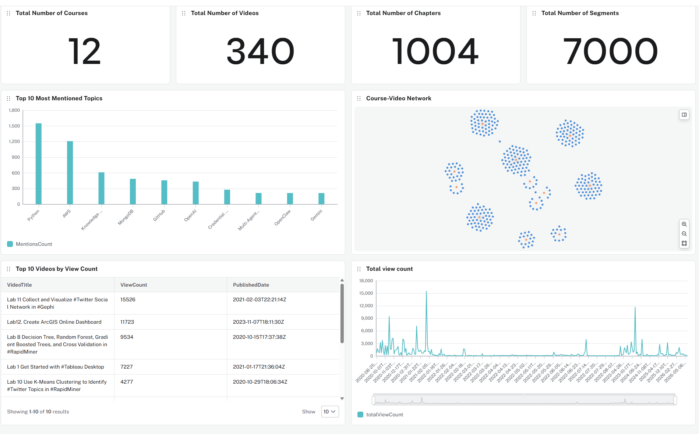

# LBSocial AI Study Mode

LBSocial AI Study Mode is a learning assistant for LBSocial courses. It helps learners ask course questions, find relevant video lessons, open timestamped YouTube sources, and turn a topic into a practical study path.

This public repository is a project window for testers, reviewers, and technical collaborators. It shows what we are building, how the learning experience works, and where people can report issues during beta testing.

**Try it:** https://lbsocial.net/lbsocial-ai  
**Main website:** https://lbsocial.net  
**Report an issue:** https://github.com/lbsocial/lbsocial-ai-public/issues/new/choose

## Study Mode Demo

## Product Snapshot

Study Mode is built on top of the LBSocial course library and a course knowledge graph. The current learning content snapshot includes:

| Content | Count |
| --- | ---: |
| Courses | 12 |
| Videos | 340 |
| Chapters | 1,004 |
| Transcript segments | 7,000 |

The graph connects courses, videos, chapters, transcript segments, topics, tools, and skills. That lets the AI tutor answer with real LBSocial learning context instead of only giving a generic AI response.

## Knowledge Graph Dashboard

## What Learners Can Do

- Ask questions about LBSocial courses, tools, workflows, and videos.
- Get answers grounded in course/video evidence when the knowledge graph finds a direct match.
- Open YouTube source cards at relevant timestamps.
- Generate a Study Path with ordered next steps.
- Continue with practice prompts such as longer path, project plan, tool focus, or skill drills.
- Use English or Chinese questions, including common speech-like variants such as OpenCloud/OpenClaw, Neo four j/Neo4j, and n eight n/n8n.
- Send quick feedback with Helpful, Not helpful, or Report a problem.

## How Study Mode Works

1. A learner asks a question in LBSocial AI.
2. The app decides whether the question needs course retrieval.
3. Specific course, tool, video, or tutorial questions are sent to the LBSocial course knowledge graph.
4. The graph searches course metadata, video chapters, transcript segments, topics, tools, and skills.
5. The tutor uses the retrieved context to answer and avoids inventing course/video/timestamp claims.
6. The app shows the answer, Study Path, source cards, and feedback controls.

Study Mode separates source quality into three practical states:

- **Direct match**: a source directly supports the user's question, so source cards can be shown.
- **Related match**: the content is useful but not an exact course/source for the request.
- **No source**: no specific LBSocial source was found, so the tutor should say that clearly.

## Report an Issue

If you are testing LBSocial AI and something feels wrong, please open an issue:

https://github.com/lbsocial/lbsocial-ai-public/issues/new/choose

Useful reports include:

- The answer was wrong or too generic.
- The video/source card was unrelated.
- The tutor missed a course that should have matched.
- The Study Path was not useful.
- Voice Tutor misunderstood the question.
- The page layout, mobile view, or feedback flow had a problem.

Please keep public issues focused on the product behavior. Do not include passwords, API keys, private account details, personal data, private screenshots, or sensitive course-access information.

## Technical Overview

The production system includes:

- A Wix member entry flow for LBSocial learners.
- A private LBSocial AI web app with Study Mode and Voice Tutor.
- A backend that handles authentication, safety checks, quota, feedback, and AI calls.
- A course knowledge graph service for retrieving course/video/chapter/transcript evidence.
- Admin beta monitoring for feedback, source quality, usage, and safety signals.

The production source code, deployment configuration, credentials, user data, logs, and internal service details remain private. Future public demo materials may be added here after they are sanitized.

Read more: [Study Mode Overview](docs/study-mode-overview.md)
